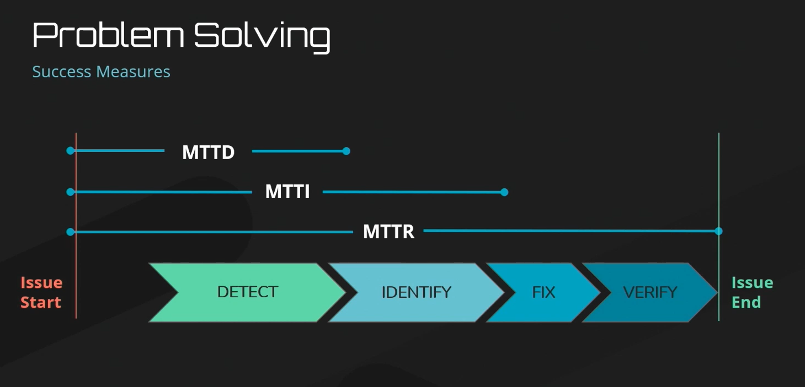

# Feature Monitoring: A New Paradigm for Operations Observability

*This talk will arm you with the tools to apply Feature Monitoring; a new paradigm that combines traditional monitoring techniques with feature rollout data to detect issues faster, eliminate alarm fatigue, and provide immediate remediation.* @HenryJewkes

> Have you seen any pushback on this approach from teams or executives? I'm sure those who get to sleep through the night would be happy, but I imagine some stakeholders and executives might be nervous at the thought of people dealing with issues in the morning instead of on the spot.

The main place of pushback I have seen is in the initial adoption of feature flags, in part due to the extra step in the process incurred in wrapping the code in the flag. However, as individuals see the benefits of safely and securely releasing features and not having to worry about rollbacks, those worries usually go away. With feature monitoring, you are actually treating the issue as it impacts customers on the spot, by manually or automatically disabling the feature. Remediation occurs faster - keeping stakeholders happy; and because fixes are then implemented at a time without the pressure and rush they are typically of higher quality and avoid the risk of sloppy mistakes.

> Can FM be used in Ops?

It certainly can! Firstly, any changes that Ops makes that involves writing code can utilize feature flags and analyse the data from the perspective of feature monitoring; whether that is spinning up systems or routing traffic such as a green / blue deployment. Additionally, Ops can partner with dev teams to ensure that any dev features are passing the release information for any metrics that you care about. This empowers your teams to know what the underlying cause of an operations alert or issue might be without needing to review recent releases.

> at the feature monitor, how do you handle scenarios of multiple features on and off. like when you have 5 features and the combination scenarios are 2^5 ?

In each case, you are able to compare the groups against one another regardless of what other features are also on at the same time. This allows you to isolate the results that are caused by any particular change, rather than needing to coordinate or explore every possible grouping

